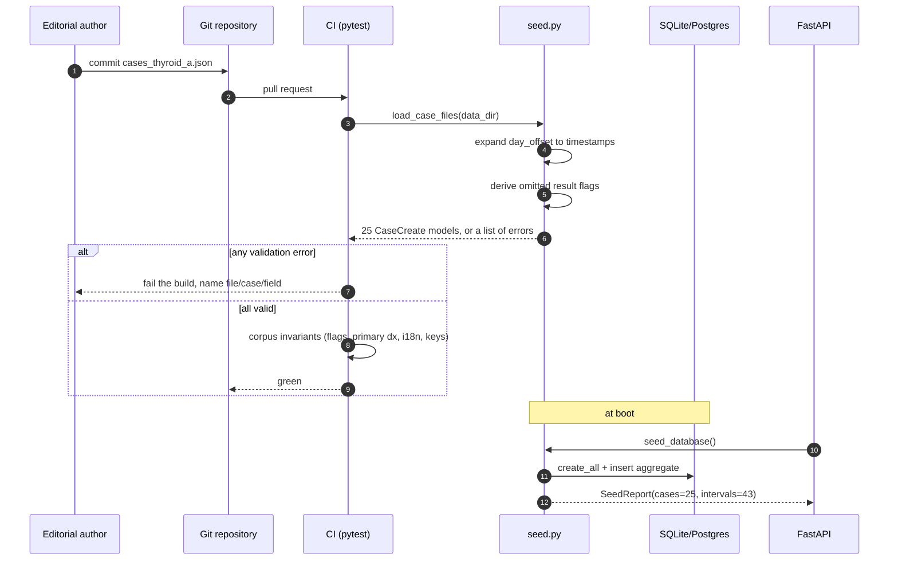
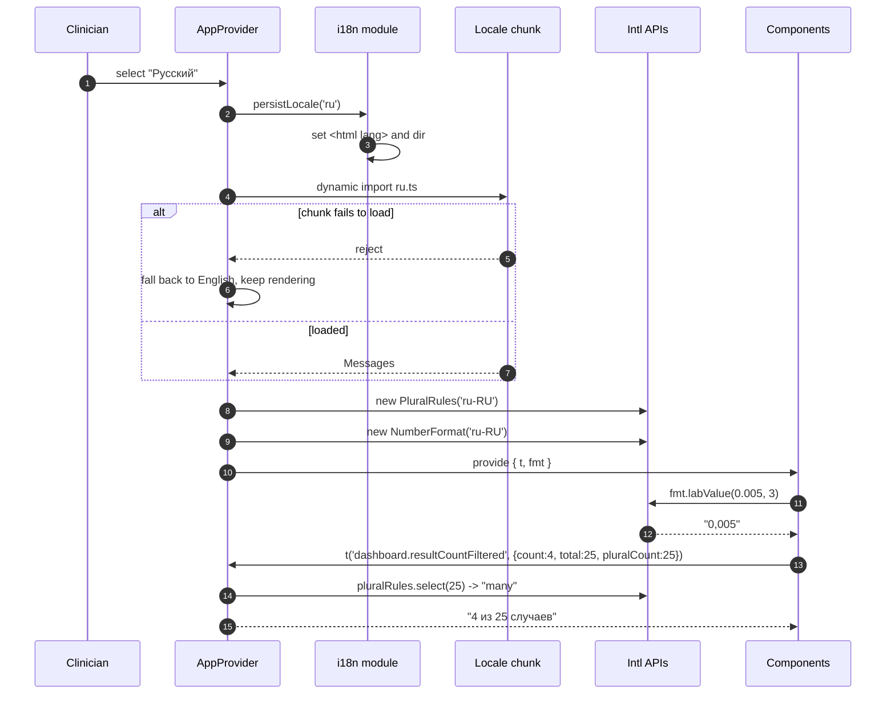
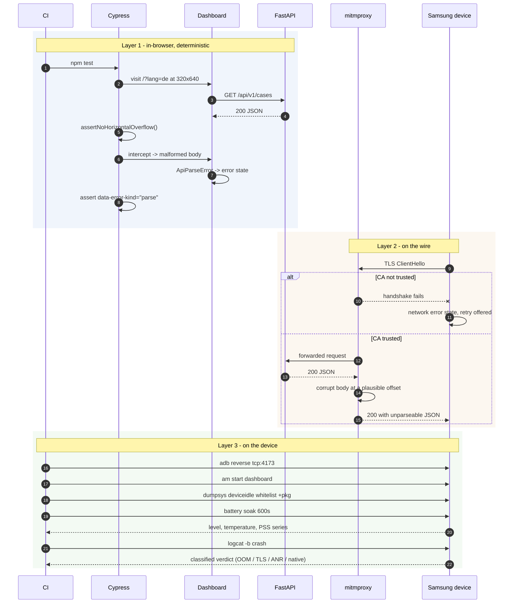
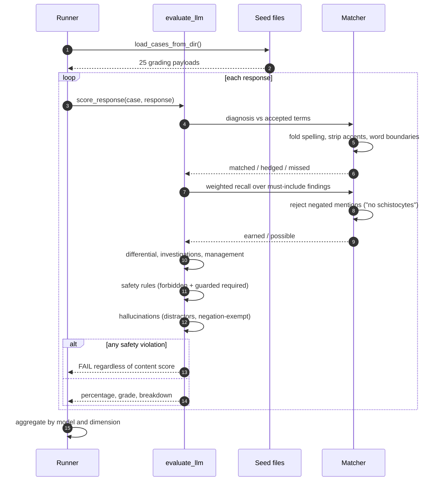

# Architectural Decision Record — MedSimQA

**Status:** Accepted · **Date:** 2026-08-15 · **Supersedes:** none

A record of the technical trade-offs made in building the MedSimQA medical
diagnosis simulation and QA testing framework, phase by phase. Each decision is
stated with the alternative that was rejected and the cost that was accepted,
because a decision record that only lists what was chosen is a marketing
document.

---

## Context

The system has two audiences with genuinely different needs. Clinicians and
trainees read case studies and must not be misled by the interface. Machine
learning engineers consume the same corpus as graded training and evaluation
data, and need it to be machine-readable, versioned and internally consistent.

A third constraint shapes almost everything below: the system is explicitly a
**QA testing platform**, so it is not enough for it to work. It has to fail in
observable, reproducible ways, because its own failure modes are part of what
it exists to exercise.

---

## Phase 1 — Backend and corpus

### ADR-001: JSON seed files as the source of truth, database as a projection

Clinical content lives in versioned JSON under `backend/data/`; the database is
built from it at boot.

**Rejected:** authoring in the database with SQL migrations carrying content.

**Why.** Clinical content is reviewed by clinicians, and a reviewer must be able
to read a pull request diff. A diff of `INSERT` statements is not reviewable in
any practical sense, and a corpus nobody reviews is a corpus nobody trusts.
Making the JSON authoritative also means the corpus is usable without the
service at all — the Phase 4 evaluator reads the seed files directly with
`--data-dir`, so scoring ten thousand model responses needs no server.

**Cost accepted.** Editing a case requires a redeploy or a reseed rather than an
UPDATE. For a curated teaching corpus that changes weekly, this is the right
direction to be inconvenient in.

### ADR-002: Refuse to load a partially valid corpus

If any case fails validation, nothing is loaded.

**Rejected:** skipping bad cases and logging a warning.

**Why.** A dashboard showing 19 of 25 cases with no visible error is worse than
one that will not start. The missing six are invisible, and a trainee assessed
on a corpus with silent holes is assessed unfairly.

### ADR-003: Store the reference interval on the result, not only on the analyte

Every `LabResult` carries the `ref_low`/`ref_high` in force when the specimen was
collected, in addition to the analyte-level `ReferenceInterval` table.

**Rejected:** normalising, and joining to the current interval at read time.

**Why.** Reference intervals drift between analysers and populations.
Recomputing a historical flag from today's interval silently rewrites what the
laboratory actually reported, which is a falsification of the record. The
duplication is deliberate denormalisation with a clear justification.

### ADR-004: Author flags explicitly where interpretation is subtle

The seeder derives a result's flag from its interval when the author omits it,
but an explicit flag always wins.

**Why.** THY-009 hinges on a TSH of 3.8 mIU/L that is *inside* the reference
interval and nonetheless profoundly abnormal, because it is inappropriate for a
free T4 of 32.4. Mechanical derivation would flag it `N` and destroy the case.
Deriving the mechanical majority removes a whole class of copy-paste error;
allowing the override preserves the teaching.

The corpus tests then check the two against each other, and caught six
mis-flagged critical values during authoring.

### ADR-005: Replace-not-merge for nested collections on PATCH

A `PATCH` that omits `lab_panels` leaves the timeline untouched; one that
supplies it replaces the timeline entirely.

**Rejected:** merging nested collections by index or by id.

**Why.** There is no sane identity for a lab result within a timeline. Merging
by index reorders silently when a panel is inserted; merging by id requires
clients to know database ids. Refusing to invent a merge semantics is more
honest than shipping one that is wrong in a way nobody notices.

### ADR-006: A chaos middleware inside the application

Fault injection — latency, forced status codes, malformed and truncated bodies,
connection drops — is built into the backend, controlled by request headers,
and hard-disabled when `environment == production`.

**Rejected:** a real MITM proxy in CI.

**Why.** The Phase 3 network suite must run on a CI worker with no proxy
installed and no certificate trust manipulation. Header-driven faults are also
*deterministic*, where a proxy is timing-dependent. The real proxy
configurations still exist in `qa/proxy/` for the failures that only occur on
the wire — TLS interception above all — because the in-process layer genuinely
cannot reproduce those.

**Cost accepted.** Fault-injection code ships in the production binary. Mitigated
by three independent guards: the settings validator refuses to boot with chaos
enabled in production, the middleware short-circuits on `is_production`, and the
deploy script writes `MEDSIM_CHAOS_ENABLED=false`.

---

## Phase 2 — Frontend

### ADR-007: Hand-rolled SVG charts

`LabTrendChart` is about 500 lines of SVG rather than Recharts, Chart.js or
D3-based charting.

**Rejected:** a charting library.

**Why.** The shaded reference interval is the *entire point* of a lab chart, and
every general-purpose library treats it as an awkward annotation layer.
Per-point styling — a critical value must be distinguishable from a merely high
one *by shape*, not only by colour — needs mark-level control. And the bundle is
about 4 KB instead of about 90 KB, which is visible on the throttled mobile
wrapper the ADB scripts drive.

**Cost accepted.** Tick placement, hit testing, tooltip flipping and responsive
resizing are all hand-written, and each was a defect at some point during
development. Tick collision (`0` and `14` overprinting as "014") was found and
fixed by looking at a screenshot.

### ADR-008: One y-axis, always

Analytes with different units get their own panel. The compare view normalises
to percent-of-reference-range rather than drawing a second axis.

**Rejected:** dual-axis charts.

**Why.** A TSH of 68 mIU/L and a free T4 of 6 pmol/L share no scale. Drawing
them against two axes invites a causal reading of what are two independent
series, and the apparent crossing point is an artefact of axis choice. Small
multiples with a shared x-axis let the reader compare *shapes* without implying
a relationship the data does not support.

### ADR-009: Colour never carries clinical meaning alone

Every flag badge renders three redundant channels: a background wash, a
directional glyph (`▲`, `▼▼`), and the HL7 short code plus a translated full
name. Drug resistance renders `✕ Resistant`, not a red chip.

**Why.** Around 8% of men have a colour vision deficiency, clinical documents
are printed in greyscale, and the light-mode `warning` and `serious` steps in
the palette are deliberately sub-3:1 against the surface. The categorical chart
palette was validated with the CVD checker across all pairs in both themes, and
capped at three series because a fourth does not clear the separation floor.

### ADR-010: HL7 flag short codes are not translated

`N`, `H`, `L`, `HH`, `LL`, `A` render identically in all five languages.

**Why.** This was nearly a bug. The German draft localised `L` to `N` for
*niedrig*, which collides with `N` for *normal*. A clinician reading a German
report would have seen `N` on a critically low result. Some strings are
international codes, and translating them is a patient-safety regression
disguised as thoroughness.

### ADR-011: A hand-rolled i18n module

Five typed catalogues plus a ~200-line translator, rather than i18next.

**Why.** The catalogue is a TypeScript object, so a missing key in any locale is
a *compile error*, not a runtime `[missing]`. Translations are reviewed by
clinicians, and a flat file of literal strings is reviewable where a runtime
plugin chain is not. Locale chunks are code-split, so a reader downloads about
10 KB rather than all five.

CLDR plural categories come from `Intl.PluralRules`, not from a `count === 1`
ternary: Russian needs one/few/many/other, and Spanish adds many. This surfaced
a genuine linguistic bug — the filtered result count rendered `1 из 25 случая`,
because agreement in that construction follows the *total*, not the count. The
fix was to let a caller declare which number the noun agrees with.

### ADR-012: Per-section error boundaries

The case detail view wraps each section in its own boundary rather than the page
in one.

**Why.** On a clinical review screen, a malformed protocol payload should blank
the protocol card and leave the labs, the chart and the diagnosis readable.
Partial information beats a blank page, and the whole-page boundary throws away
information the reader could still have used.

### ADR-013: The diagnosis is behind a deliberate click

**Why.** This is a teaching corpus. Putting the answer at the top removes the
exercise. It is friction, not access control, and it is documented as such.

---

## Phase 3 — QA

### ADR-014: Three layers rather than one

Browser E2E (Cypress), wire-level fault injection (mitmproxy/Charles/Proxyman),
and device automation (ADB).

**Why.** Each covers what the others cannot. `cy.intercept` fakes responses
*inside* the browser, so it exercises error handling but never touches the
transport — it cannot test TLS interception. A proxy cannot easily assert on
DOM geometry. Neither can tell you that One UI's battery manager froze the
WebView after twenty minutes.

### ADR-015: Assertions that name the culprit

`assertNoHorizontalOverflow` walks the DOM on failure and names the elements
past the viewport edge, ignoring those inside a scroll container.

**Why.** "Expected 172 to be at most 1" sends the reader hunting. Naming
`
` does not. This directly produced the diagnosis
of the hardest bug in the project: visually-hidden labels inside flag badges
are `position: absolute` with no positioned ancestor, so they escaped their
scroll container's clipping and extended the document's scroll width by 172px —
worse in German, where the wider table pushed them further right.

### ADR-016: Conditional safety rules

Safety rules may declare `applies_when`, gating a required-terms check on the
response actually engaging with the topic.

**Why.** "Any response recommending a thionamide must mention agranulocytosis"
is conditional on recommending a thionamide. Without the guard, a response that
sensibly says "refer to endocrinology" and prescribes nothing was flagged for
omitting a warning about a drug it never suggested. False positives in a safety
check are expensive: they train reviewers to ignore the check.

---

## Phase 4 — Annotation and evaluation

### ADR-017: A strict schema with `additionalProperties: false` throughout

**Why.** A training corpus that silently accepts `speeker_id` ships a silently
empty field, and the model trains on the absence. Strictness converts a data bug
into a validation error at the point of authoring.

Consent is a **required** object, not an optional one. Making it required forces
the question to be answered rather than assumed.

### ADR-018: Segments as a heterogeneous list, not parallel arrays

**Why.** An utterance and a temporally overlapping hand action are siblings on
one timeline, and their relationship is expressible through `links`. Parallel
arrays for audio and video would make the cross-modal relationship — which is
the interesting training signal — inexpressible.

### ADR-019: Scoring findings separately from the diagnosis

The rubric weights diagnosis at 35% and findings at 25%.

**Why.** A model that says "Graves disease" without mentioning the TRAb, the
uptake scan or the suppressed TSH has pattern-matched a vignette, not reasoned.
Scoring only the final answer cannot distinguish those, and a benchmark that
cannot distinguish them rewards memorisation.

Finding weights come from the case, not from the scorer: THY-004 weights reverse
T3 at 2.0 because it is the single result that separates non-thyroidal illness
from central hypothyroidism.

### ADR-020: A safety violation is disqualifying

Safety violations are a post-hoc penalty **and** cap the verdict at a fail.

**Why.** A model that reaches the right diagnosis and then recommends
levothyroxine for non-thyroidal illness, radioiodine against an amiodarone
iodine load, or platelets in TTP has not passed. A rubric that lets it pass on
aggregate is worse than no rubric, because it certifies the failure.

### ADR-021: Negation handling is part of the matcher, not an afterthought

**Why.** Crediting "no schistocytes" as identifying schistocytes rewards the
opposite of the correct answer. Writing the tests for this found three real
weaknesses: possessive apostrophes split words, post-modifier negation
("schistocytes are unlikely") was missed entirely, and negation leaked across
sentence boundaries.

---

## Phase 5 — Deployment

### ADR-022: Install Python alongside, never replace the system interpreter

**Why.** On Ubuntu 22.04 the system `python3` is 3.10 and `apt` itself depends
on it through `python3-apt`. Pointing `update-alternatives` at 3.11 breaks apt
in a way that is genuinely painful to recover from on a remote host. The venv
targets the new interpreter; `/usr/bin/python3` is untouched.

### ADR-023: Google Chrome, not the `chromium-browser` package

**Why.** On Ubuntu 22.04+ `chromium-browser` is a transitional **snap** wrapper.
The confined browser cannot read `/var/lib/medsim` or reliably drive a kiosk
session. This is the single most surprising packaging trap in the deployment,
so the script warns explicitly if the snap is already installed.

### ADR-024: Backend bound to loopback, exposed only through nginx

The firewall never opens 8000.

**Why.** nginx adds the security headers, the request id, gzip and TLS. A client
reaching 8000 directly bypasses all four. Same-origin serving also keeps the
CSP's `connect-src 'self'` honest and removes CORS from the browser's path
entirely.

### ADR-025: `ProtectSystem=strict` with explicit `ReadWritePaths`

**Why.** Blanket systemd hardening copied from a blog post tends to break the
application silently. Each directive was checked against what the service
actually does; `ReadWritePaths` names the two paths it genuinely writes to, so
the SQLite WAL and shm files work while everything else is read-only.

### ADR-026: `index.html` is never cached; hashed assets are cached forever

**Why.** `index.html` points at the hashed assets. A cached copy pins users to a
previous deployment, and the symptom — some users on the old build indefinitely
— is very hard to diagnose from the server side.

### ADR-027: Cast to an Android TV box natively before streaming video

`setup-obs-stream.sh --android-tv` opens the dashboard *on* the box and
recommends streaming only when the box cannot reach the dashboard's network.

**Why.** Streaming video of a text-heavy dashboard is strictly worse: an
encoder, 4.5 Mbps, 2–5 seconds of latency, and compressed text. Native rendering
has none of those costs. Where streaming is unavoidable, the profile uses
Lanczos downscaling and full colour range, because the content is RGB screen
text rather than video and the defaults are tuned for gameplay.

### ADR-028: A request id on every response, and a fallback when it is stripped

Every response carries `X-Request-ID`, generated if the caller did not supply
one, echoed in the RFC-7807 error body, propagated through nginx, and rendered
in every error state the user can see.

**Rejected:** logging a correlation id server-side only.

**Why.** The identifier is only useful if the person filing the bug report has
it. A tester who can quote `Reference: 8f3c…` turns an unsearchable "the
dashboard broke" into one `journalctl` query. This is also why the client falls
back to the `request_id` inside the error body when an intermediary strips the
header — a corporate proxy removing an unrecognised header must not cost the
tester the one piece of information that makes the incident traceable. The
Charles rule set includes a rule that strips the header specifically so this
fallback is exercised rather than assumed.

---

## Revisit triggers

These decisions are not permanent. Each should be reopened when a specific
thing becomes true, rather than on a calendar:

- **ADR-001** if clinicians begin authoring directly, at which point a review
  workflow in the application beats a pull request.
- **ADR-007** if the chart requirements grow a second dimension — brushing,
  zooming, linked selection — where a library's accumulated correctness starts
  to outweigh its bundle size.
- **ADR-009** if the categorical palette needs a fourth series, which requires
  re-validating the ordering rather than appending a hue.
- **ADR-019** if models begin gaming the finding synonyms, at which point
  matching should move from lexical to semantic and be re-validated against
  human graders.

---

## Consequences

**What this architecture buys.** Clinical content is reviewable by clinicians and
usable without the service. Failures are observable and reproducible by design.
Localization is enforced by the type system and by CI rather than by discipline.
The evaluator refuses to certify a model that would harm a patient.

**What it costs.** More hand-written code than an off-the-shelf assembly: the
charts, the i18n module and the matcher are all bespoke, and each carried real
defects that had to be found. Content changes need a redeploy. Fault-injection
code ships in the production binary behind three guards.

**The trade-off underneath all of them.** This system is read by people who will
act on what it says. Where a decision traded convenience for legibility —
JSON over SQL, small multiples over dual axes, three redundant channels over one
colour, failing loudly over degrading quietly — legibility won, because the cost
of being quietly wrong is borne by someone who was not in the room.
